# Integration of a Fuzzy Rule-Based Microservice in .NET for Real-Time Cyber Threat Monitoring with Interpretable Risk Ratings

Abstract. We present an architecture and prototype implementation of a high-performance .NET microservice that produces interpretable, real-time risk scores for cyber events by combining word-embedding vectors, Random Forest feature selection, classical ML classifiers and a fuzzy rule-based (FLRB) inference engine. The system is designed for operational use in Security Operations Centers (SOC) and to integrate with existing SIEM pipelines. Key contributions include a reproducible data pipeline from raw text logs to mood/feature vectors, an automated genetic-algorithm method for synthesis of compact and interpretable fuzzy rule bases, engineering patterns for low-latency .NET hosting, and a set of evaluation results addressing detection accuracy, scoring interpretability and runtime scalability.

Background and motivation. Modern SIEMs increasingly adopt machine learning and AI to augment signature and rule-based detection, yet operations teams require interpretable outputs to act quickly. Next-generation SIEMs rely on ML to reduce noise and surface actionable anomalies, therefore integrating interpretable scoring that can explain risk drivers is essential for trust and remediation. ([hunters.security][1]) Classical supervised models such as SVM and Random Forest are strong baseline detectors for text-based indicators when combined with robust features derived from word embeddings. Studies show that word-embedding representations can capture semantic signals in network and log data, while Random Forest remains effective at selecting informative components from those vectors. ([ResearchGate][2]) Fuzzy rule-based inference adds robustness to partial, noisy inputs and provides human-readable rules that map feature patterns to risk levels.

Method overview. The proposed pipeline has four logical stages. Stage 1 performs tokenization and vectorization of textual fields from logs, alerts and tickets using WordVec/Word2Vec or equivalent embedding models to produce dense vector representations that encode semantics of messages. Stage 2 applies Random Forest feature importance ranking to reduce dimensionality, identify the most discriminative embedding components and produce a compact vector of key features for downstream models. Stage 3 runs fast classifiers (SVM or Random Forest) to provide a primary anomaly/prediction signal and feature-level confidences. Stage 4 applies an FLRB module that takes the compact feature vector and classifier outputs, evaluates a curated set of fuzzy rules and produces a scalar risk rating together with an explanation in the form of activated linguistic rules. The FLRB rule base is synthesized and tuned offline using a genetic algorithm that optimizes both score accuracy and rule compactness, then shipped to the microservice as a deployable, versioned rule artifact. Evidence from the literature supports the practical use of genetic algorithms for automatic synthesis and tuning of fuzzy rule bases across control and classification domains. ([dspace.chmnu.edu.ua][3])

FLRB design and rule synthesis. We represent each fuzzy antecedent as a linguistic variable with parameterized membership functions. Candidate rules are encoded as chromosomes and evolved to maximize an objective that balances predictive performance on labeled incidents and interpretability constraints such as rule length and feature coverage. Genetic operators include crossover that mixes antecedent sets, mutation that perturbs membership parameters and tournament selection that favors compact, robust rules. Prior works demonstrate that genetic synthesis achieves compact, well-performing rule sets in noisy environments, making this approach suitable for security telemetry where labels are limited and noisy. ([dspace.chmnu.edu.ua][3])

Implementation notes in .NET. The microservice is implemented as an ASP.NET Core application exposing a low-latency HTTP/REST and gRPC API for ingestion and query. The service has two deployable components. A lightweight inference container exposes endpoints for single-event risk scoring and returns both numeric score and an explanation (the top activated fuzzy rules and their firing strengths). A separate offline orchestration container handles batch retraining, rule synthesis via the genetic algorithm and packaging of the new FLRB artifact. Fuzzy logic functionality can be implemented using existing .NET libraries such as Accord.Fuzzy and open implementations of fuzzy inference, or by calling performant native libraries such as fuzzylite via interop when stricter performance is desired. ([NuGet][4]) To enable fast classification, the SVM/RF models are exported in ONNX and consumed via onnxruntime .NET bindings for consistent, low-latency inference.

Operational integration and data engineering. For production readiness the microservice integrates with SIEM and streaming platforms. Ingest is handled through a message bus (Kafka or Event Hubs) with schema validation and lightweight pre-processing. A connector ingests enriched SIEM events, extracts textual fields, and pushes them to the vectorization worker. Scoring results and explanations are forwarded to the SIEM as JSON payloads and inserted into the incident index, enabling correlation with other telemetry and automated playbooks. The architecture supports both synchronous scoring for analyst workflows and asynchronous bulk scoring for nightly enrichment. Best practices for SIEM integration emphasize non-blocking ingestion, idempotent message processing and clear provenance metadata for each score. ([Lansweeper][5])

Generative AI for data augmentation. Real cyber incident labels are scarce, so we use controlled generative models to synthesize realistic log messages and attack narratives for training and stress tests. Large language models and conditional sequence generators can produce diverse attack variants that expand training coverage. Recent empirical work shows LLM-based augmentation can improve detection performance when combined with classical ML baselines, provided synthetic data is validated for realism and label fidelity. ([Nature][6]) We keep augmentation in offline pipelines and gate synthetic data with human review before use in production models.

Evaluation strategy. The evaluation suite measures detection quality, interpretability, latency and throughput. Detection quality uses standard classification metrics such as precision, recall and AUC on held-out incident datasets. Interpretability is assessed by (a) rule compactness, (b) percent of incidents explained by top-k rules and (c) analyst ratings on whether explanations make remediation actions clearer. Latency targets aim for sub-50 ms median per-event scoring for synchronous calls at modest scale, and throughput targets align with peak SIEM ingestion rates via horizontal scaling. We run load tests using realistic event streams to measure CPU, memory and p99 latency and tune batch sizes and model quantization accordingly.

Scalability and robustness. The microservice is containerized and deployed using Kubernetes with autoscaling based on observed CPU and request latency. The inference tier is stateless and horizontally scalable, while rule artifacts are mounted from a versioned object store enabling quick rollbacks. To handle noisy or missing inputs the FLRB gracefully degrades by using partial rule matching and returning an uncertainty measure, which improves operator trust compared with opaque single-score outputs.

Security, governance and explainability. All model artifacts and rule versions are auditable. The service logs feature attributions and rule firings for each scored event into a secure index for audit and post-incident analysis. Governance includes an approval pipeline for deploying new rule sets, and periodic human-in-the-loop review of rules that materially change scoring behavior.

Discussion and future directions. The proposed FLRB microservice bridges model performance and human interpretability, making it a practical addition to SOC toolchains. Future work includes continuous online adaptation of rules using streaming GA updates, tighter orchestration with detection playbooks, and richer multimodal inputs (binary telemetry, network flows) for hybrid fuzzified scoring. There is also potential to open a two-way feedback loop from analysts to the genetic rule synthesizer so that domain knowledge can be incorporated directly into the evolutionary prior.

Conclusions. Combining WordVec embeddings, Random Forest feature selection, fast classifiers and an evolved fuzzy rule base yields a practical, interpretable risk-scoring microservice that fits into modern .NET-centric enterprise stacks and SIEM ecosystems. The proposed architecture balances accuracy, explainability and latency, and supports operational governance processes required by enterprise SOCs.

# Mathematical and algorithmic basis for NLP, feature selection and FLRB

Word embedding objective, notation and vector usage. Let the corpus be a sequence of tokens w1..wT. For skip-gram Word2Vec we maximize the log probability
[
\mathcal{L}=\sum_{t=1}^{T}\sum_{-c\le j\le c, j\ne0}\log P(w_{t+j}\mid w_t).
]
Using softmax, the conditional probability is
[
P(w_o\mid w_i)=\frac{\exp(u_{w_o}^\top v_{w_i})}{\sum_{w\in V}\exp(u_w^\top v_{w_i})},
]
where (v_{w}) and (u_{w}) are input and output vectors and (V) is vocabulary. In practice negative sampling approximates the denominator. After training each token has a dense embedding (x\in\mathbb{R}^d). Sentence or log message vectors are formed by mean pooling or weighted sum of token vectors. For context sensitivity, document vectors may use TF-IDF weights (x_{doc}=\frac{1}{\sum_i \text{tfidf}_i}\sum_i \text{tfidf}*i v*{w_i}).

Distance and similarity. Use cosine similarity for vector comparisons. For vectors a and b:
[
\cos(\theta)=\frac{a^\top b}{|a||b|}.
]
Cosine is robust to length differences in log messages and commonly used in nearest neighbor retrieval and clustering.

Random Forest feature importance and dimensionality reduction. Given a set of candidate embedding dimensions or aggregated textual features, train Random Forest on labeled incidents. Use mean decrease in impurity (Gini importance) or permutation importance to rank features. For Gini importance, for a node with impurity (I) split into children with impurities (I_L) and (I_R) and samples (n), the importance contribution is (\Delta I = I - \frac{n_L}{n}I_L - \frac{n_R}{n}I_R). Aggregate (\Delta I) across all splits and trees to get per-feature importance. Select top-k features to build a compact vector (z\in\mathbb{R}^k).

SVM and Random Forest for fast classification. For SVM with kernel (K), decision rule
[
f(z)=\text{sign}\left(\sum_{i=1}^{N}\alpha_i y_i K(z_i,z) + b\right).
]
SVM provides margin-based confidence. Random Forest returns class probability via tree vote averaging. Use ONNX export for runtime portability.

Fuzzy sets, membership functions and Mamdani inference. Define linguistic variables (X) with terms (A_j) and membership functions (\mu_{A_j}(x)) e.g., triangular or Gaussian. For triangular centered at (c) with left/right spread (l,r):
[
\mu(x)=
\begin{cases}
0 & x\le c-l\
\frac{x-(c-l)}{l} & c-l < x \le c\
\frac{(c+r)-x}{r} & c < x < c+r\
0 & x\ge c+r
\end{cases}
]
A fuzzy rule is: IF feature1 is High AND feature2 is Medium THEN Risk is High. Rule activation uses t-norm. For Mamdani inference using min t-norm, rule firing strength (w=\min_j \mu_{A_j}(x_j)). Aggregate consequents by max, then defuzzify using centroid:
[
y^*=\frac{\int y \mu_{aggreg}(y) dy}{\int \mu_{aggreg}(y) dy}.
]

Encoding FLRB for optimization. Represent rule base as list of antecedent descriptors and membership parameters. A chromosome encodes binary presence of antecedents, and continuous parameters for membership functions. Fitness balances accuracy on labeled dataset and interpretability penalty:
[
\text{fitness}=\alpha\cdot\text{AUC} - \beta\cdot\frac{|\text{rules}|}{R_{max}} - \gamma\cdot\text{mean_antecedents_per_rule}.
]
Tune (\alpha,\beta,\gamma) to reflect priority for accuracy vs compactness.

Genetic algorithm operators. Population of chromosomes. Selection via tournament. Crossover mixes antecedent masks and membership parameters. Mutation perturbs parameters by Gaussian noise and toggles antecedent presence with low probability. Evaluate fitness by running FLRB inference on validation set. Keep elite individuals for stability.

Pipeline pseudocode (high level). Tokenize logs. Generate embeddings. Aggregate to message vector. Apply Random Forest importance selector to pick top-k features. Feed compact vector to classifier and FLRB. Use GA to produce and update rule base offline. At inference time produce score plus explanation as list of top activated rules with strengths.

# PlantUML 1-page architecture and sequence diagram

Copy the PlantUML below into any PlantUML editor to render the architecture diagram and the sequence of component calls.

```plantuml
@startuml
' Title
title FLRB .NET Microservice for Real-Time Cyber Risk Scoring

' Components
package "Data & SIEM" {
  [SIEM / Event Store] as SIEM
  [Message Bus (Kafka/EventHubs)] as BUS
}
package "Preprocessing" {
  [Vectorizer Worker\n(Word2Vec/Tokenizer)] as VEC
  [Feature Selector\n(RandomForest)] as FS
}
package "Inference" {
  [Classifier\n(ONNX SVM / RF)] as CLS
  [FLRB Engine\n(Accord.Fuzzy / native)] as FLRB
  [Score API\n(ASP.NET Core/gRPC)] as API
}
package "Offline" {
  [GA Rule Synthesizer\n(Trainer)] as GA
  [Model Repo / Object Store] as REPO
}
SIEM -> BUS : publish event (log, alert)
BUS -> VEC : ingest event
VEC -> FS : produce compact vector z
FS -> CLS : send z
CLS -> API : class probabilities + feature confidence
API -> FLRB : z + classifier outputs
FLRB -> API : risk score + explanation
API -> SIEM : push score + explanation (enriched event)

' Offline flows
GA -> REPO : save new rule artifact
REPO -> API : deploy new rule artifact (versioned)
note right: API mounts artifact read-only\nsupports rollback

@enduml
```



# .NET prototype scaffold. Minimal runnable project and snippets

Project assumptions. Use .NET SDK 7+ or 8. The scaffold is minimal. Add NuGet packages: Microsoft.ML.OnnxRuntime, Accord.Fuzzy (or Accord.FuzzyCompat), MathNet.Numerics if needed. The scaffold exposes a single POST /api/score endpoint that accepts JSON event text and returns score plus explanation.

Project file snippet `FLRBService.csproj`:

```xml
<Project Sdk="Microsoft.NET.Sdk.Web">
  <PropertyGroup>
    <TargetFramework>net7.0</TargetFramework>
    <Nullable>enable</Nullable>
    <ImplicitUsings>enable</ImplicitUsings>
  </PropertyGroup>
  <ItemGroup>
    <PackageReference Include="Microsoft.ML.OnnxRuntime" Version="2.15.0" />
    <PackageReference Include="Accord" Version="3.8.0" />
    <PackageReference Include="Accord.Fuzzy" Version="3.8.0" />
    <PackageReference Include="MathNet.Numerics" Version="4.15.0" />
  </ItemGroup>
</Project>
```

Program.cs (minimal API):

```csharp
using Microsoft.ML.OnnxRuntime;
using Microsoft.ML.OnnxRuntime.Tensors;
using System.Text.Json.Serialization;
using Accord.Fuzzy;

var builder = WebApplication.CreateBuilder(args);
var app = builder.Build();

// Load ONNX session and FLRB artifact on startup
var onnxSession = new InferenceSession("models/classifier.onnx");
var flrb = FlrbEngine.LoadFrom("artifacts/flrb.json");

app.MapPost("/api/score", async (ScoreRequest req) =>
{
    // 1. Vectorize: call local vectorizer or simple TF-IDF placeholder
    var vector = LocalVectorizer.Vectorize(req.Text); // returns float[]
    // 2. Feature selection: assume we expect k dims
    var z = FeatureSelector.SelectTopK(vector, k: 32);
    // 3. Classifier ONNX inference
    var input = new DenseTensor<float>(new[] {1, z.Length});
    for (int i=0;i<z.Length;i++) input[0,i] = z[i];
    var inputs = new List<NamedOnnxValue> { NamedOnnxValue.CreateFromTensor("input", input) };
    using var results = onnxSession.Run(inputs);
    var probs = results.First().AsEnumerable<float>().ToArray(); // adapt to model
    // 4. FLRB inference
    var (score, explanation) = flrb.Infer(z, probs);
    return Results.Json(new { score, explanation, probs });
});

app.Run();

record ScoreRequest([property: JsonPropertyName("text")] string Text);

// Stubs for classes referenced above follow
```

LocalVectorizer and FeatureSelector are small helper classes. Example simple implementations you can replace with full Word2Vec worker.

```csharp
public static class LocalVectorizer
{
    // Placeholder. Replace with real embedding lookup and pooling.
    public static float[] Vectorize(string text)
    {
        var tokens = text.Split(' ', StringSplitOptions.RemoveEmptyEntries);
        var rnd = new Random(0);
        var d = 128;
        var v = new float[d];
        for (int i = 0; i < d; i++) v[i] = (float)(rnd.NextDouble() - 0.5);
        return v;
    }
}

public static class FeatureSelector
{
    public static float[] SelectTopK(float[] vec, int k)
    {
        if (vec.Length <= k) return vec;
        var top = new float[k];
        Array.Copy(vec, top, k);
        return top;
    }
}
```

Accord.Fuzzy small FLRB engine wrapper and loader example:

```csharp
public class FlrbEngine
{
    private readonly LinguisticVariable riskVar;
    private readonly List<FuzzyRule> rules;
    private readonly FuzzyEngine engine;

    private FlrbEngine(LinguisticVariable riskVar, List<FuzzyRule> rules, FuzzyEngine engine)
    {
        this.riskVar = riskVar;
        this.rules = rules;
        this.engine = engine;
    }

    public static FlrbEngine LoadFrom(string path)
    {
        // Load JSON that includes variable defs and rule list
        var json = File.ReadAllText(path);
        var obj = System.Text.Json.JsonSerializer.Deserialize<FlrbSpec>(json)!;
        var engine = new FuzzyEngine();
        var variables = new List<LinguisticVariable>();
        foreach (var v in obj.InputVars)
        {
            var lv = new LinguisticVariable(v.Name);
            foreach (var term in v.Terms)
                lv.AddLabel(new TrapezoidalFunction(term.Name, term.A, term.B, term.C, term.D));
            engine.LinguisticSystem.AddVariable(lv);
            variables.Add(lv);
        }
        var riskLv = new LinguisticVariable("Risk");
        foreach (var t in obj.OutputTerms)
            riskLv.AddLabel(new TrapezoidalFunction(t.Name, t.A, t.B, t.C, t.D));
        engine.LinguisticSystem.AddVariable(riskLv);
        foreach (var r in obj.Rules)
            engine.LinguisticSystem.Rules.Add(FuzzyRule.Parse(r.Text));
        return new FlrbEngine(riskLv, obj.Rules.ToList(), engine);
    }

    public (double score, object explanation) Infer(float[] z, float[] classifierOutputs)
    {
        // Map z values to input vars, run engine, return defuzzified value and activated rules summary
        for (int i = 0; i < Math.Min(z.Length, engine.LinguisticSystem.Variables.Count); i++)
        {
            engine.SetInput(i, z[i]);
        }
        engine.Process();
        var outVal = engine.GetOutput("Risk");
        var explanation = new { firedRules = "placeholder" };
        return (outVal, explanation);
    }

    private class FlrbSpec
    {
        public InputVarSpec[] InputVars { get; set; } = Array.Empty<InputVarSpec>();
        public TermSpec[] OutputTerms { get; set; } = Array.Empty<TermSpec>();
        public string[] Rules { get; set; } = Array.Empty<string>();
    }
    private class InputVarSpec { public string Name { get; set; } = ""; public TermSpec[] Terms { get; set; } = Array.Empty<TermSpec>(); }
    private class TermSpec { public string Name { get; set; } = ""; public double A, B, C, D; }
}
```

Small GA rule builder (skeleton). This is a simplified GA you can expand and connect to fitness measured by FLRB prediction error.

```csharp
public class SimpleGa
{
    public class Chromosome { public bool[] AntecedentMask; public double[] Params; public double Fitness; }
    public List<Chromosome> Run(int popSize, int generations, Func<Chromosome,double> fitnessFunc)
    {
        var rnd = new Random();
        var pop = new List<Chromosome>();
        for (int i=0;i<popSize;i++)
            pop.Add(new Chromosome { AntecedentMask = Enumerable.Range(0, 20).Select(_ => rnd.NextDouble() < 0.2).ToArray(), Params = Enumerable.Range(0,10).Select(_ => rnd.NextDouble()).ToArray() });
        for (int g=0; g<generations; g++)
        {
            foreach (var c in pop) c.Fitness = fitnessFunc(c);
            pop = pop.OrderByDescending(c=>c.Fitness).Take(popSize/2).ToList();
            // Crossover & mutate to refill
            while (pop.Count < popSize)
            {
                var a = pop[rnd.Next(pop.Count)];
                var b = pop[rnd.Next(pop.Count)];
                var child = new Chromosome { AntecedentMask = new bool[a.AntecedentMask.Length], Params = new double[a.Params.Length] };
                for (int i=0;i<child.AntecedentMask.Length;i++) child.AntecedentMask[i] = rnd.NextDouble()<0.5 ? a.AntecedentMask[i] : b.AntecedentMask[i];
                for (int i=0;i<child.Params.Length;i++) child.Params[i] = (a.Params[i] + b.Params[i]) / 2.0 + (rnd.NextDouble()-0.5)*0.05;
                pop.Add(child);
            }
        }
        return pop.OrderByDescending(c=>c.Fitness).ToList();
    }
}
```

How to run locally. Create a new folder, add the csproj and code files shown, restore packages with `dotnet restore`, build with `dotnet build`, and run with `dotnet run`. Replace placeholders with your real Word2Vec vectorizer, ONNX model file at `models/classifier.onnx` and `artifacts/flrb.json` rule artifact.


Selected supporting sources. Word-embedding and feature studies. ([ResearchGate][2]) Genetic synthesis for fuzzy rules and adaptive fuzzy controllers. ([dspace.chmnu.edu.ua][3]) .NET and fuzzy libraries. ([NuGet][4]) Next-generation SIEM with AI. ([hunters.security][1])


[1]: https://www.hunters.security/en/blog/next-gen-siem-ai-cloud-secops?utm_source=chatgpt.com "Next-Gen SIEM: How AI and Cloud are Redefining SecOps ..."
[2]: https://www.researchgate.net/publication/348565257_Feature_extraction_based_on_word_embedding_models_for_intrusion_detection_in_network_traffic?utm_source=chatgpt.com "(PDF) Feature extraction based on word embedding ..."
[3]: https://dspace.chmnu.edu.ua/jspui/bitstream/123456789/1656/1/Kozlov%2C%20O.%2C%20Kondratenko%2C%20Y..pdf?utm_source=chatgpt.com "Automatic Synthesis of Rule Bases of Fuzzy Control ..."
[4]: https://www.nuget.org/packages/Accord.Fuzzy/3.5.4-alpha?utm_source=chatgpt.com "Accord.Fuzzy 3.5.4-alpha"
[5]: https://www.lansweeper.com/blog/itam/a-comprehensive-guide-to-siem-security-tools/?utm_source=chatgpt.com "A Comprehensive Guide to SIEM Security Tools"
[6]: https://www.nature.com/articles/s41598-025-05182-y?utm_source=chatgpt.com "Optimization for threat classification of various data types ..."
